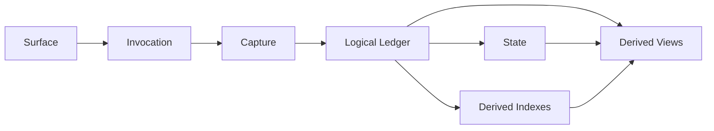

# Architecture

This is the singular canonical architecture document for `gotta` 1.0.

The top-level split is:

- this document: what the system is
- [TODO.md](https://github.com/anthonyrisinger/gotta/blob/main/docs/TODO.md):
  what gets built next
- the live code: what already exists

## Reading Rule

- If this document and the live code disagree, treat the difference as
  implementation drift to be resolved deliberately.
- If `TODO.md` and this document disagree, this document defines the doctrine
  and `TODO.md` should be corrected.

## One Sentence

`gotta` is a session-aware logical artifact ledger with routed acquisition
surfaces, provider-native capability bundles, explicit operator state
channels, and derived views and indexes that read outward from durable local
truth.

## Core Transaction

The irreducible core is:

```text
argv -> resolved invocation -> capture -> materialize -> stored artifact
```

Everything truly core exists to make that path:

- stable
- attributable
- reopenable
- durable

## The Skeleton

At the tightest level, the system has three layers:

1. surfaces
2. ledger
3. views



## Primitives

### Surface

An operator-facing entrypoint that expresses intent.

Examples:

- `gotta github`
- `gotta read`
- `gotta search`
- `gotta session`
- `gotta notes`
- `gotta exec`

### Surface Binding

The installed, operator-visible binding of one surface to one command path and
one local configuration.

This is what makes all of these valid at once:

- `gotta github ...`
- `gotta jira ...`
- `gotta ask sre ...`
- `gotta ask it ...`

CLI-visible names are bindings, not packages.

### Distribution Package

An installable unit that may export:

- one provider bundle
- multiple provider bundles from one vendor family
- one or more federated or ask-family surfaces

Examples:

- one Atlassian-family package could ship `jira` and `confluence`
- one Google-family package could ship `gdrive`, `gdocs`, and `gsheets`
- one ask-family package could ship one Kapa implementation with multiple
  bindings

### Provider Bundle

A coherent family of provider-native capabilities.

Provider bundles own:

- route claims
- canonical locators
- preferred names
- capture
- projection
- provider-native read/search/mutate behavior
- auth/status helpers when relevant

### Capability

A thing the system can do through one provider or surface.

Examples:

- read one artifact
- search one provider
- mutate one remote issue
- render one stored artifact
- build one derived graph view

### Invocation

A normalized request for one capability with enough metadata to decide:

- which surface or provider owns it
- whether it materializes
- what its canonical locator is
- what name and content type it should have

### Capture

Canonical acquired bytes plus enough metadata to project and store them
correctly.

### Projection

Operator-facing rendering derived from canonical bytes.

Projection is not storage truth. Projection is a downstream view.

### Materialization

The act of turning canonical bytes into durable ledger state.

### Artifact

A materialized unit of durable discovery or evidence.

### Session

A durable working overlay that lets operator work survive compaction.

### Actor

A named working identity inside one shared session.

### Derived View

A view computed from the artifact ledger and session state, not authoritative
truth in its own right.

### Derived Backend

An optional derived index/query engine that accelerates or enriches views
without becoming authoritative truth.

Memgraph and Kuzu belong here.

## Non-Negotiable Invariants

### 1. The Logical Artifact Ledger Is Authoritative

The canonical thing is the logical artifact ledger, not the current filesystem
layout.

For 1.0, the filesystem remains the default authoritative implementation of
that ledger. Canonical truth remains locally rebuildable through:

- content digests
- artifact metadata
- logical aliases and reopen handles
- fetch/materialization history
- manifest rows

### 2. Capture Precedes Projection

Canonical bytes come first.

Projection is downstream and may degrade display. It may not redefine storage
truth.

### 3. Context Exists At Write Time

Artifacts are written in context, not in isolation.

That context includes:

- session root
- actor attribution
- invocation metadata
- source/provider metadata

### 4. Session Splits Cleanly In Two

Authored session channels:

- `want`
- `goal`
- `notes`
- `logs`
- `todo`
- `oops`
- actor metadata and state

Derived session views:

- `manifest`
- `timeline`
- `graph`
- `leads`
- `analyze`
- `scan`

The first group is truth by authorship. The second is truth by derivation.

### 5. Provider Bundle Is Not Command Surface

These are distinct concepts:

- command surface
- surface binding
- distribution package
- provider bundle
- capability
- backend

The CLI may project them through one `gotta <surface> ...` interface, but the
system must not confuse them internally.

### 6. `read` And `search` Are Intent Surfaces

They are not provider bundles. They route across providers because they express
operator intent, not provider identity.

### 7. `ask` Is An Extension Surface

It is binding-driven and may legitimately install one implementation multiple
times with different names and auth profiles.

### 8. Leads Are Artifact-Grounded

Leads may be pluggable in:

- extraction
- canonicalization
- edge construction
- aggregation
- ranking
- backend acceleration

But they remain grounded in artifacts.

### 9. External Graph And Semantic Systems Are Derived Indexes

Memgraph, Kuzu, SQLite, DuckDB, and similar systems are optional accelerators
over the ledger, never the authoritative store.

### 10. `exec` Must Be Explicit

The escape hatch belongs in the system only as an explicit evidence surface.

There is no silent fallback from provider failure to arbitrary local command
execution.

### 11. Anonymous Semantic Shapes Are Temporary

The hardening move is:

- named records at package boundaries
- named records for persisted and operator-visible payloads
- named records for semantically meaningful intermediate structures
- protocols at extension boundaries
- temporary adapter locals only at immediate parsing or serialization edges

Anonymous `dict`, `list`, tuple, and `Any`-shaped semantic payloads are
temporary scaffolding only.

If a shape:

- crosses a package boundary
- persists to disk
- appears in an operator-visible payload
- survives long enough to accumulate logic
- has a semantic name in the architecture

then it must exist in code as a named type.

The intended end state is not merely typed boundaries. The intended end state
is that semantically meaningful anonymous shapes disappear from the system.

## Surface Taxonomy

### Provider Surfaces

- `github`
- `jira`
- `confluence`
- `slack`
- `gdrive`
- `gdocs`
- `gsheets`
- `grafana`
- `granola`

### Federated Intent Surfaces

- `read`
- `search`
- `ask`

### Session State And Workflow Surfaces

- `notes`
- `logs`
- `todo`
- `want`
- `goal`
- `oops`
- `actor`

`actor` is the supervisory workflow edge case.

### Derived Session Views

- `session manifest`
- `session timeline`
- `session graph`
- `session leads`
- `session analyze`
- `session scan`

### Control Surfaces

- `config`
- provider `auth` and `status` families

## Package And Provider Model

The package/provider split is:

- distribution package
- vendor family
- provider bundle
- surface binding

This yields:

- Google as one vendor family with multiple surfaces
- Atlassian as one vendor family with multiple provider bundles
- Slack split cleanly between provider capability, local archive/index
  behavior, and admin/control concerns

## Ledger And Storage Model

The deeper stable storage split is:

- `LedgerStore`
- `BlobStore`
- `StateStore`

The derived-query/backend split is:

- `GraphIndexBackend`
- `LeadIndexBackend`
- `SemanticIndexBackend`

For 1.0:

- the logical artifact ledger is mandatory
- the local filesystem is the default authoritative implementation
- in-process derived views are mandatory
- external graph or semantic backends are optional accelerators

That storage split requires:

1. named logical records
2. ontology above filesystem shape
3. logical ledger operations separated from concrete filesystem implementation
4. alternate stores layered in only after the contracts exist

## Session Model

The session core should own:

- binding to the current execution context
- shared-session and actor-root topology
- actor registry and attribution
- session bootstrap
- operator-authored state channels

The session core should not own:

- provider-specific retrieval semantics
- graph-database-specific query logic
- bespoke analysis backends

Everything in session should sort into one of three buckets:

1. authored state
2. derived views
3. control and bootstrap

If it does not, it probably belongs elsewhere.

## Backend Model

Derived backends should expose explicit contracts for:

- ingest
- rebuild
- query
- health
- staleness

Suggested interface families:

- `GraphIndexBackend`
- `LeadIndexBackend`
- `SemanticIndexBackend`

These answer typed queries and typed results.

## Type System

The type system is not decorative annotation.

It is:

- named records for persisted, exported, and cross-package data
- named payload families for derived views
- named semantic aggregates inside packages once they stop being throwaway
- protocols at extension boundaries
- temporary anonymous adapter locals only at immediate library edges

The doctrine is strict:

- exported record families must be named
- persisted record families must be named
- derived payload families must be named
- semantically meaningful intermediate aggregates must converge to named types

Anonymous shapes may exist only as short-lived adapters at parsing,
serialization, or foreign-library boundaries, and must not become
architectural truth.

The record families made explicit at package boundaries are:

- `Capture`
- `Projection`
- `ArtifactKind`
- `ArtifactRecord`
- `ArtifactMetadata`
- `AliasRecord`
- `MaterializationEvent`
- `ManifestEntry`
- `SessionBindingRecord`
- `ActorStateRecord`
- `StateChannelRecord`
- `LeadMention`
- `LeadEdge`
- `LeadSourceSummary`
- `LeadResolution`
- `GraphPayload`
- `TimelineEvent`
- `AnalyzeOverview`
- `LineagePayload`
- `SemanticPayload`

The protocol families made explicit at extension boundaries are:

- `RouteClaimant`
- `ArtifactProvider`
- `SearchProvider`
- `Projector`
- `Mutator`
- `LeadExtractor`
- `LeadRanker`
- `GraphIndexBackend`
- `LeadIndexBackend`
- `SemanticIndexBackend`

## Canonical Contract Shapes

The doctrine is not complete unless the core nouns have operational shapes.

These are architectural contracts, not final Python signatures or wire
formats.

### Registry And Binding Contracts

`PackageSpec`

- one installable distribution unit
- declares one vendor family
- exports one or more surfaces
- exports zero or more provider bundles

`SurfaceSpec`

- parses operator input into a normalized invocation request
- runs a resolved invocation through the surface-specific control path
- may delegate capture, projection, or mutation to provider bundles

`SurfaceBinding`

- one installed CLI-visible binding
- declares:
  - binding name
  - command path
  - package name
  - surface name
  - provider bundle when relevant
  - auth profile
  - defaults

`CommandPath`

- the operator-visible command hierarchy for one installed binding
- examples:
  - `github`
  - `session manifest`
  - `ask sre`

`CapabilitySpec`

- one declared capability family owned by a provider or surface
- canonical families are:
  - route
  - read
  - search
  - capture
  - project
  - mutate
  - auth
  - status

`InvocationRequest`

- raw operator intent after CLI parsing but before routing completion
- carries:
  - entry surface
  - argv
  - explicit session
  - explicit actor
  - save-as and similar operator modifiers

`Invocation`

- resolved capability request ready for capture, mutation, or view execution
- carries:
  - entry surface and argv
  - resolved surface and argv
  - provider
  - capability
  - canonical locator
  - preferred name
  - content type
  - artifact kind
  - materialization policy
  - session access mode

### Capture, Ledger, And State Contracts

`Capture`

- canonical bytes
- suggested name
- content type
- source metadata
- view metadata

`Projection`

- operator-facing display bytes or structured rendering
- language or format metadata
- explicit degradation markers when projection loses fidelity

`LedgerStore`

- persists artifact records
- appends manifest entries
- appends materialization events
- resolves aliases and reopen handles

`BlobStore`

- stores immutable canonical bytes by digest
- answers existence and retrieval by digest

`StateStore`

- stores authored session state
- appends channel records
- stores and retrieves actor state

`GraphIndexBackend` / `LeadIndexBackend` / `SemanticIndexBackend`

- optional derived backends
- ingest artifact and state truth
- rebuild from ledger truth
- answer typed graph, lead, and semantic queries
- report health and staleness

### Exported Record Families

Registry and invocation:

- `PackageSpec`
- `SurfaceSpec`
- `SurfaceBinding`
- `CommandPath`
- `CapabilitySpec`
- `ProviderBundle`
- `InvocationRequest`
- `Invocation`

Artifact ledger:

- `Capture`
- `Projection`
- `ArtifactRecord`
- `ArtifactMetadata`
- `AliasRecord`
- `MaterializationEvent`
- `ManifestEntry`
- `VisibilityMetadata`

Session and state:

- `SessionBindingRecord`
- `SessionIdentity`
- `ActorIdentity`
- `ActorStateRecord`
- `StateChannelRecord`

Derived views:

- `LeadMention`
- `LeadEdge`
- `LeadSourceSummary`
- `LeadResolution`
- `GraphNode`
- `GraphEdge`
- `GraphPayload`
- `TimelineEvent`
- `AnalyzeOverview`
- `LineagePayload`
- `SemanticPayload`

## Implementation Map

These are the primary implementation loci for the architectural contracts
named above.

| Logical Contract | Implementation Locus |
| --- | --- |
| `InvocationRequest` / `Invocation` | `src/gotta/resolve/` and `src/gotta/dispatch/` |
| `Capture` / `Projection` | `src/gotta/capture.py`, `src/gotta/stored.py`, and provider `project(...)` hooks |
| `LedgerStore` | `src/gotta/content/store.py` |
| `BlobStore` | `src/gotta/content/store.py` and `src/gotta/content/file.py` |
| `StateStore` | `src/gotta/notes/`, `src/gotta/logs.py`, `src/gotta/todo.py`, and `src/gotta/session/` |
| `GraphIndexBackend` / `LeadIndexBackend` / `SemanticIndexBackend` | `src/gotta/plugins/session/backend.py` with in-process builders in `src/gotta/lead/` and `src/gotta/plugins/session/` |
| `ProviderBundle` | provider-facing plugin surfaces under `src/gotta/plugins/` and shared provider helpers under `src/gotta/providers/` |
| `SurfaceSpec` | top-level dispatch through `src/gotta/builtin.py`, `src/gotta/cli/`, and plugin runners |
| `SurfaceBinding` | registry names, config, and entry-point names |
| `PackageSpec` | Python distribution and entry-point packaging |

## Current Live Drift

The doctrine above is the target shape. The current implementation still has a
small set of explicit drifts that must be resolved deliberately before deeper
provider or algorithm surgery:

- the registry still centers a flat `PluginSpec` shim rather than explicit
  `SurfaceBinding`, `SurfaceSpec`, `ProviderBundle`, and `CapabilitySpec`
  records
- `src/gotta/content/model.py` and `src/gotta/content/store.py` still export
  filesystem-shaped ledger truth rather than purely logical ledger records
- federated `search` still carries runner/stdout fallback capture instead of
  always resolving into explicit provider search/capture/project hooks
- several derived view and session payload families still move anonymous
  `dict`-shaped records where the architecture already assigns stable names

## `exec` Surface

`gotta` includes an explicit command-evidence surface:

```bash
gotta exec -- <command> [args...]
```

Canonical evidence capture should include:

- argv
- cwd
- exit status
- started_at
- finished_at
- duration
- stdout
- stderr
- stdin provenance
- environment policy

`exec` results should materialize as canonical `evidence` and feed:

- manifest
- timeline
- graph
- leads
- analyze

## Non-Goals

These are specifically not the 1.0 direction:

- making an external graph database the authoritative store
- replacing provider-native commands with one giant generic command
- flattening CLI names into package identity
- letting arbitrary provider surfaces bypass canonical capture and
  materialization
- conflating session state, provider capabilities, and analysis backends
- resuming topology churn where the remaining pressure is really contract,
  type, or algorithm work

## Execution Queue

The canonical execution queue is:

- [TODO.md](https://github.com/anthonyrisinger/gotta/blob/main/docs/TODO.md)

That file should answer “what next?”

This document should answer:

- what the system is
- what must not change
- what kinds exist
- where each kind belongs
- what 1.0 means
